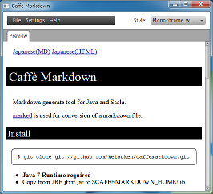

[Japanese(MD)](README_ja.md)
[Japanese(HTML)](README_ja.html)


# Caffè Markdown

Markdown generate tool for Java and Scala.

[marked](https://github.com/chjj/marked) is used for conversion of a markdown file.





## Install

```
$ git clone git://github.com/keisuken/caffemarkdown.git
```

* **Java 7 Runtime required**
* Copy from JRE jfxrt.jar to $CAFFEMARKDOWN_HOME/lib


## Usage


### Command line

Windows:

```
caffemd [style_name] input
```

Mac or Linux:

```
caffemd.sh [style_name] input
```

ex: (Windows)

```
caffemd default example.md
```


### GUI(Java FX)

Click for caffemdgui.bat or caffemdgui.sh .


#### Settings

##### Select wkhtmltopdf

1.Execution menu bar's "Settings" - "select wkhtmltopdf"
2.Select wkhtmltopdf(HTML to PDF converter) execution file

##### output to PDF

If otuput to PDF then check "output to PDF" menu item.


#### Open and generatet Markdown file

Execution menu bar' "File" - "Open and generate" menu item.


### Scala

```
import jp.cappuccino.tools.markdown.Markdown
...

// Create markdown generator.
val markdown = new Markdown

// Generate HTML.
val source = "# Header\n\nHello, Markdown tool!"
val style = Style.load(".", Style.Default)
val title = "Hello, Markdown!"
val html = markdown.generate(source, style, title)

// Print HTML.
println(html)
```

```
import jp.cappuccino.tools.markdown.Markdown
...

// Generate Markdown file.
val home = new File(".")
val styleName = Style.Default
val inpFile = new File("example.md")
val html = Markdown.generate(home, styleName, inpFile)

// Print HTML.
println(hrml)
```


## API Reference

See [Caffè Markdown](docs/api/index.html) .


## License

Copyright (C) 2014, NISHIMOTO Keisuke. (MIT License)

See:

* [LICENSE](LICENSE.txt)
* [marked LICENSE](marked-LICENSE.txt)
* [Scala LICENSE](Scala-LICENSE.txt)
